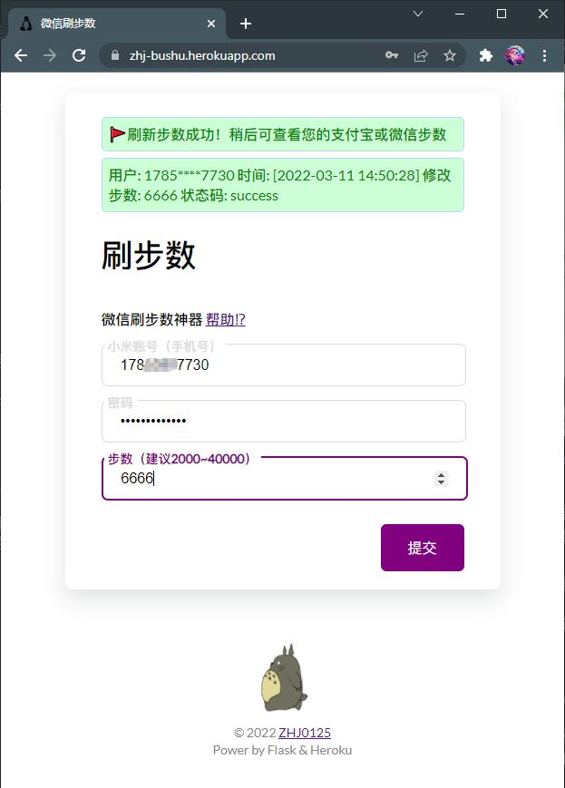

# bushu 刷步数

> ‼ 声明：本项目仅供娱乐及学习交流使用

⚠ 提示：请在下午或晚上时间段刷步数，深夜凌晨可能会运行失败。

项目部署地址：[https://zhj-bushu.herokuapp.com](https://zhj-bushu.herokuapp.com/)

### 项目概述

顾名思义，本项目就是来帮助你躺着刷步数的。经测试，目前可以同步修改步数至 `微信运动` 和 `支付宝运动`。

* 如果您是使用者，想快速实现刷步数，请阅读[用户手册](docs/UserManual.md)
* 如果您是开发者，想了解本项目如何运行，请阅读[开发手册](docs/DevManual.md)
* 如果您想了解我在入门 Flask 时编写的代码，请转至 [Flask-Learn](https://github.com/ZHJ0125/bushu/tree/Flask-Learn) 分支

### 依赖项目

* [mimotion](https://github.com/577fkj/mimotion) ( Apache License 2.0 ) - 小米运动刷步数
* [Flask](https://github.com/pallets/flask) ( BSD 3-Clause "New" or "Revised" License ) - 用于构建 Web 应用程序的 Python 微框架

### 开源协议

* 本项目使用 [GNU General Public License v3.0](https://github.com/ZHJ0125/bushu/blob/main/LICENSE) 开源许可协议
* Gitee地址：https://gitee.com/zhj0125/bushu （用户手册已被ban）
* GitHub地址：https://github.com/ZHJ0125/bushu
